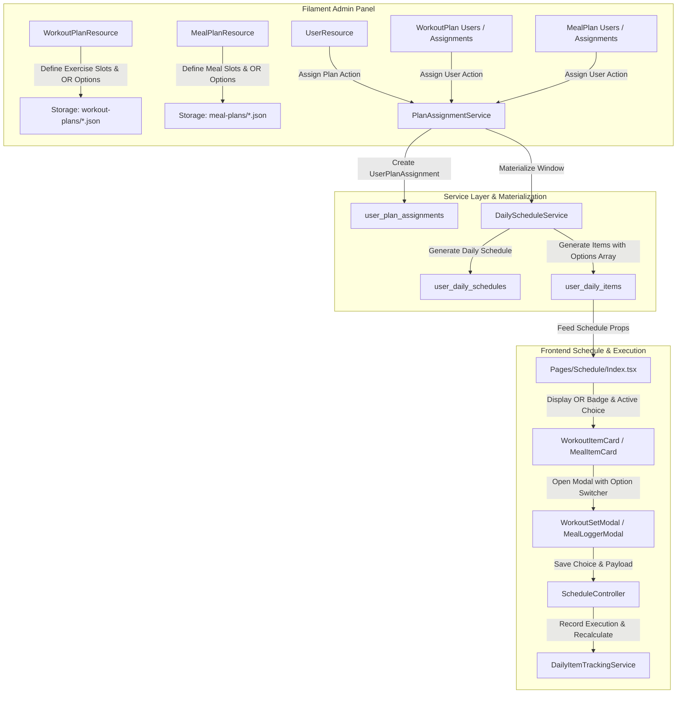

# Filament Admin Panel Updates & Optional Paths (OR Alternatives) Implementation Plan

> **Slug:** `filament-plans-and-optional-paths`  
> **Status:** Ready for Review  
> **Goal:** Update the Filament Admin Panel for Workout Plans and Meal Plans to support the new `UserPlanAssignment` materialized architecture, build robust Plan Assignment actions, and implement end-to-end support for optional paths (e.g. Exercise 1 OR Exercise 2, Meal 1 OR Meal 2) across Filament, the Backend Service Layer, and the React/Inertia Frontend.

---

## User Review Required

> [!IMPORTANT]
> **Data Structure Update for Workout Plans**:
> Workout plans will now use a nested "Exercise Slots" $\rightarrow$ "Options (OR Alternatives)" schema, mirroring the Meal Plans builder.
> - For standard exercises: a slot contains 1 option.
> - For optional paths: a slot contains 2+ alternative exercises (e.g., *Barbell Bench Press (4×10)* **OR** *Dumbbell Chest Press (3×12)*).
> - Backward compatibility will be maintained by automatically wrapping legacy flat workout items into an options array during loading/editing.

> [!NOTE]
> **Plan Assignments in Filament**:
> Since legacy pivot tables (`user_workout_plan`, `user_meal_plan`) were deprecated in favor of `user_plan_assignments` and materialized daily schedules, all assignment actions in Filament (in `UserResource`, `WorkoutPlanResource`, and `MealPlanResource`) will now leverage `PlanAssignmentService::assignPlan()` with configurable `start_date` and `end_date`, automatically triggering schedule materialization.

---

## Proposed Architecture & Changes



---

## Proposed Changes

### Component 1: Filament Workout Plan & Meal Plan Management

#### [MODIFY] [WorkoutPlanResource.php](file:///e:/johnfit/app/Filament/Resources/WorkoutPlanResource.php)
- Update form schema to support exercise slots with nested `options` repeater:
  - `days` $\rightarrow$ `workouts` (Exercise Slots) $\rightarrow$ `options` (Alternatives: `workout_id`, `reps` preset, live preview placeholder).
  - Add action on Table & Header: **"Assign to User"** modal with User select, `start_date` (default today), and `end_date` (default +4 weeks).
- Update RelationManagers:
  - Refactor `UsersRelationManager` to interact with `UserPlanAssignment` records (`plan_type = 'workout'`), displaying user name, email, dates, status, and an **"Assign User"** action calling `PlanAssignmentService`.

#### [MODIFY] [WorkoutPlanServices.php](file:///e:/johnfit/app/Services/WorkoutPlanServices.php)
- Update `savePlanAsJson` to serialize the nested options structure cleanly.
- Update `loadDataFromJsonFile` to extract workout and reps preset IDs from nested options, while providing backward compatibility for flat array formats.

#### [MODIFY] [EditWorkoutPlan.php](file:///e:/johnfit/app/Filament/Resources/WorkoutPlanResource/Pages/EditWorkoutPlan.php)
- Update `mutateFormDataBeforeFill` to normalize any legacy flat workout items into `{ options: [...] }` so the Filament Repeater populates seamlessly.

#### [MODIFY] [MealPlanResource.php](file:///e:/johnfit/app/Filament/Resources/MealPlanResource.php)
- Refine existing `options` repeater in `MealPlanResource`.
- Add Table & Header action: **"Assign to User"** modal with User select, `start_date`, `end_date`, and execution via `PlanAssignmentService`.
- Refactor `MealPlanResource/RelationManagers/UsersRelationManager.php` to display `UserPlanAssignment` records (`plan_type = 'meal'`) and provide an **"Assign User"** header action.

#### [MODIFY] [pdf_templates/workout-plan.blade.php](file:///e:/johnfit/resources/views/pdf_templates/workout-plan.blade.php) & [meal-plan.blade.php](file:///e:/johnfit/resources/views/pdf_templates/meal-plan.blade.php)
- Update PDF generation templates to display "— OR —" badges and layout when a slot has multiple exercise or meal alternatives.

---

### Component 2: Filament User Plan Assignments

#### [NEW] [PlanAssignmentsRelationManager.php](file:///e:/johnfit/app/Filament/Resources/UserResource/RelationManagers/PlanAssignmentsRelationManager.php)
- Create a dedicated RelationManager for `UserResource` managing `UserPlanAssignment`:
  - **Columns**: Plan Type (`workout` / `meal`), Plan Name, Start Date, End Date, Status badge (`active`, `completed`, `cancelled`), Created At.
  - **Header Action "Assign Plan"**:
    - Select Plan Type (`workout` | `meal`).
    - Select Plan Template (`WorkoutPlan::pluck('name', 'id')` or `MealPlan::pluck('name', 'id')` dynamically based on type).
    - Select `start_date` (default today) & `end_date` (default +4 weeks).
    - Calls `PlanAssignmentService::assignPlan($user, $planId, $planType, $startDate, $endDate)`.
  - **Row Actions**: Change status (activate/complete/cancel), Edit dates, Delete assignment.

#### [MODIFY] [UserResource.php](file:///e:/johnfit/app/Filament/Resources/UserResource.php)
- Register `PlanAssignmentsRelationManager::class` in `getRelations()`.
- Add quick Table Action **"Assign Plan"** to easily assign a plan to any user directly from the user table list.

#### [MODIFY] [UserPlanAssignment.php](file:///e:/johnfit/app/Models/UserPlanAssignment.php)
- Add relationships:
  - `workoutPlan()`: `belongsTo(WorkoutPlan::class, 'plan_id')`
  - `mealPlan()`: `belongsTo(MealPlan::class, 'plan_id')`
  - `getPlanNameAttribute()`: dynamic accessor returning the plan's name.

---

### Component 3: Backend Materialization & Tracking Services

#### [MODIFY] [DailyScheduleService.php](file:///e:/johnfit/app/Services/DailyScheduleService.php)
- **`materializeWorkoutItems()`**:
  - Support slots with 1 or more options.
  - Extract all options with full workout metadata (muscles, tools, thumb, video_url) and reps presets (sets_count, target_reps array).
  - Store full `options` list and `primary_option` in `target_details`.
  - Initialize `execution_payload` with `selected_workout_id = primary_option.workout_id` and initial sets for the primary option.
- **`materializeMealItems()`**:
  - Ensure `target_details.options` contains full macro data per option.
  - Initialize `execution_payload` with `consumed_option_id = primary_option.meal_id` and default quantity.

#### [MODIFY] [DailyItemTrackingService.php](file:///e:/johnfit/app/Services/DailyItemTrackingService.php)
- **`saveWorkoutSets(User $user, int $itemId, array $sets, ?int $selectedWorkoutId = null)`**:
  - If `$selectedWorkoutId` is passed, update `execution_payload['selected_workout_id'] = $selectedWorkoutId`, update `$item->item_name` and `$item->reference_id` to match the selected option.
  - Persist sets and mark item completed if all sets are finished; recalculate daily scores.
- **`saveMealConsumption(User $user, int $itemId, int $optionId, float $quantity = 1.0)`**:
  - Look up selected meal option, update `$item->item_name` and `$item->reference_id = $optionId`.
  - Save `consumed_option_id` and `consumed_quantity` in `execution_payload`; recalculate daily scores.

#### [MODIFY] [ScheduleController.php](file:///e:/johnfit/app/Http/Controllers/ScheduleController.php)
- Validate optional `selected_workout_id` in `saveWorkoutSets` request payload.

---

### Component 4: React / Inertia Frontend (UI / UX for Optional Paths)

#### [MODIFY] [types/index.d.ts](file:///e:/johnfit/resources/js/types/index.d.ts)
- Add TypeScript interfaces:
  - `ItemWorkoutOption`: `workout_id`, `name`, `muscles`, `tools`, `thumb`, `video_url`, `sets_count`, `reps_preset_name`, `target_reps`.
  - Update `UserDailyItemTargetDetails` with `options?: ItemWorkoutOption[] | ItemMealOption[]`.
  - Update `UserDailyItemExecutionPayload` with `selected_workout_id?: number`, `consumed_option_id?: number`, `consumed_quantity?: number`.

#### [MODIFY] [WorkoutItemCard.tsx](file:///e:/johnfit/resources/js/Pages/Schedule/Components/WorkoutItemCard.tsx)
- Detect if `options && options.length > 1`.
- Display a badge: `⚡ {options.length} Options (OR)`.
- Render the active selected exercise name, muscles, and sets summary based on `execution_payload.selected_workout_id` or primary option.

#### [MODIFY] [WorkoutSetModal.tsx](file:///e:/johnfit/resources/js/Pages/Schedule/Components/WorkoutSetModal.tsx)
- Add an interactive option selector (pill tabs) at the top of the modal when `options.length > 1`:
  - Shows each alternative (e.g. `Option 1: Barbell Bench Press` vs `Option 2: Dumbbell Chest Press`).
  - Switching options dynamically adjusts the exercise details (muscles, video link, target reps count/structure).
  - When saving, sends `{ sets, selected_workout_id: activeOption.workout_id }` to the backend.

#### [MODIFY] [MealItemCard.tsx](file:///e:/johnfit/resources/js/Pages/Schedule/Components/MealItemCard.tsx)
- Display `⚡ {options.length} Options (OR)` badge when multiple meal options exist in a slot.
- Display chosen/consumed meal details and dynamic macro pills.

#### [MODIFY] [MealLoggerModal.tsx](file:///e:/johnfit/resources/js/Pages/Schedule/Components/MealLoggerModal.tsx)
- Polish option cards to show alternative meal macros and instant portion recalculations, ensuring seamless switching between Meal 1 OR Meal 2.

---

## Verification Plan

### Automated Tests
1. **Plan Assignment & Materialization**:
   - `tests/Feature/DailyScheduleTest.php`: Add tests for assigning workout/meal plans with single and multi-option slots.
   - Assert `user_daily_items` contains populated `options` in `target_details`.
2. **Optional Path Execution**:
   - Test saving workout sets with alternative `selected_workout_id` $\rightarrow$ assert `item_name`, `reference_id`, and `execution_payload` update correctly.
   - Test saving meal consumption with alternative `option_id` $\rightarrow$ assert `item_name`, `reference_id`, and scores update correctly.
3. **Run Test Suite**:
   ```bash
   php artisan test --filter="DailyScheduleTest"
   ```

### Frontend Typecheck & Build Verification
1. Run TypeScript compiler:
   ```bash
   npx tsc --noEmit
   ```
2. Run Vite production build:
   ```bash
   npm run build
   ```

### Manual Interactive Verification in Filament Admin & App
1. Open Filament Admin Panel (`/admin`):
   - Navigate to **Workout Plans** $\rightarrow$ Create a new plan with an exercise slot containing 2 alternatives (e.g. Incline Bench OR Dumbbell Incline).
   - Use the **"Assign to User"** action to assign it to a test user.
   - Navigate to **Users** $\rightarrow$ Open user record $\rightarrow$ Verify **Plan Assignments** relation tab shows active workout plan.
2. Open User Schedule Frontend (`/schedule`):
   - Verify the workout item displays the `2 Options (OR)` badge.
   - Click "Log Sets" $\rightarrow$ Switch to Option 2 $\rightarrow$ Enter weights/reps $\rightarrow$ Save.
   - Verify item is marked completed with Option 2's name and logged sets.
   - Do the same for a Meal slot with Meal 1 OR Meal 2.
