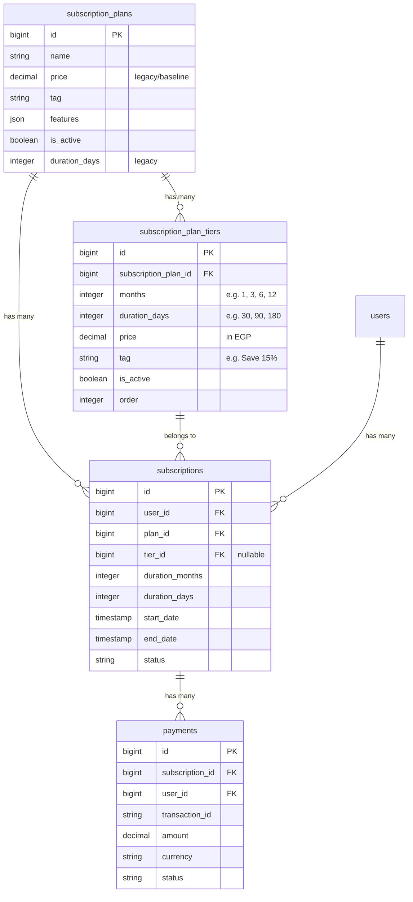

# Implementation Plan: Dynamic Multi-Duration Subscription Tiers

## Goal Description
Upgrade JohnFit's subscription architecture to make subscription durations and their pricing **completely dynamic and admin-controllable**. Instead of hardcoding fixed duration columns (like 1, 3, or 6 months), plans will support any number of duration tiers (e.g., 1 month, 3 months, 6 months, 12 months, etc.) with custom pricing, access duration, and promotional badges managed directly in the Filament Admin panel.

---

## User Review Required

> [!IMPORTANT]
> **Dynamic Relational Architecture (`subscription_plan_tiers`):**
> We are introducing a dedicated `subscription_plan_tiers` table linked to `subscription_plans`.
> * Each tier configures: `months` (e.g. 1, 3, 6, 12), `duration_days` (e.g. 30, 90, 180, or auto-calculated as `months * 30`), `price` (in EGP), `tag` (e.g. "Save 15%", "Best Value"), and `is_active`.
> * In Filament Admin, admins manage these via a live **Repeater** where tiers can be added, edited, or reordered dynamically without database migrations or code changes.
> * The existing `price` column on `subscription_plans` is kept as a backward-compatible baseline.

> [!NOTE]
> **Dynamic Frontend Selector (`Packages.tsx`):**
> The duration selector pills (e.g., 1 Month / 3 Months / 6 Months / etc.) at the top of `/packages` will be **dynamically derived** from the active tiers returned by the backend. When an admin adds a new tier (like "12 Months") in Filament, it automatically appears on the frontend pricing toggle without requiring frontend code edits.

---

## Architecture & Data Model



---

## Proposed Changes

### 1. Database Migrations

#### [NEW] `database/migrations/2026_09_26_000001_create_subscription_plan_tiers_table.php`
- Creates table `subscription_plan_tiers`:
  - `id`
  - `foreignId('subscription_plan_id')->constrained('subscription_plans')->cascadeOnDelete()`
  - `unsignedInteger('months')` (1, 3, 6, etc.)
  - `unsignedInteger('duration_days')->nullable()` (defaults to `months * 30` if null)
  - `decimal('price', 10, 2)`
  - `string('tag')->nullable()`
  - `boolean('is_active')->default(true)`
  - `unsignedInteger('order')->default(0)`
  - `timestamps()`

#### [NEW] `database/migrations/2026_09_26_000002_add_tier_and_duration_to_subscriptions.php`
- Modifies `subscriptions`:
  - `foreignId('tier_id')->nullable()->after('plan_id')->constrained('subscription_plan_tiers')->nullOnDelete()`
  - `unsignedInteger('duration_months')->default(1)->after('tier_id')`
  - `unsignedInteger('duration_days')->default(30)->after('duration_months')`

---

### 2. Models & Business Logic

#### [NEW] [`app/Models/SubscriptionPlanTier.php`](file:///e:/johnfit/app/Models/SubscriptionPlanTier.php)
- Fillable: `subscription_plan_id`, `months`, `duration_days`, `price`, `tag`, `is_active`, `order`.
- Casts: `months` => 'integer', `duration_days` => 'integer', `price` => 'decimal:2', `is_active` => 'boolean', `order` => 'integer'.
- Relationships:
  - `plan()`: BelongsTo [`SubscriptionPlan`](file:///e:/johnfit/app/Models/SubscriptionPlan.php).
- Accessor: `effective_days`: returns `duration_days ?: ($months * 30)`.

#### [MODIFY] [`app/Models/SubscriptionPlan.php`](file:///e:/johnfit/app/Models/SubscriptionPlan.php)
- Relationships:
  - `tiers()`: HasMany `SubscriptionPlanTier` ordered by `order`, then `months`.
  - `activeTiers()`: HasMany `SubscriptionPlanTier` where `is_active = true` ordered by `order`, then `months`.
- Helper methods:
  - `getTierForMonths(int $months): ?SubscriptionPlanTier`
  - `getPriceForMonths(int $months): float` (falls back to `$this->price`)
  - `getDaysForMonths(int $months): int` (falls back to `$months * 30`)

#### [MODIFY] [`app/Models/Subscription.php`](file:///e:/johnfit/app/Models/Subscription.php)
- Add fillable: `tier_id`, `duration_months`, `duration_days`.
- Relationships:
  - `tier()`: BelongsTo `SubscriptionPlanTier`.

---

### 3. Backend Checkout & Webhooks

#### [MODIFY] [`app/Http/Controllers/SubscriptionController.php`](file:///e:/johnfit/app/Http/Controllers/SubscriptionController.php)
- **`packages()`**:
  - Load active plans with their active tiers:
    ```php
    $plans = SubscriptionPlan::where('is_active', true)
        ->with(['activeTiers'])
        ->get();
    ```
- **`initiate(Request $request)`**:
  - Validate:
    ```php
    $request->validate([
        'plan_id' => 'required|exists:subscription_plans,id',
        'tier_id' => 'required|exists:subscription_plan_tiers,id',
    ]);
    ```
  - Fetch plan and tier (ensuring tier belongs to plan):
    ```php
    $plan = SubscriptionPlan::findOrFail($request->plan_id);
    $tier = $plan->activeTiers()->findOrFail($request->tier_id);
    ```
  - Create subscription recording tier and duration:
    ```php
    $subscription = Subscription::create([
        'user_id' => $user->id,
        'plan_id' => $plan->id,
        'tier_id' => $tier->id,
        'duration_months' => $tier->months,
        'duration_days' => $tier->effective_days,
        'status' => 'pending',
    ]);
    ```
  - Create payment with `$tier->price`.
- **`callback(Request $request)`**:
  - Activate subscription:
    ```php
    $days = $payment->subscription->duration_days ?: 30;
    $payment->subscription->update([
        'status' => 'active',
        'start_date' => now(),
        'end_date' => now()->addDays($days),
    ]);
    ```

#### [MODIFY] [`app/Listeners/HandleKashierWebhook.php`](file:///e:/johnfit/app/Listeners/HandleKashierWebhook.php)
- Use `$payment->subscription->duration_days ?: 30` when activating.

---

### 4. Filament Admin Panel

#### [MODIFY] [`app/Filament/Resources/SubscriptionPlanResource.php`](file:///e:/johnfit/app/Filament/Resources/SubscriptionPlanResource.php)
- Add a dynamic **Duration & Pricing Tiers** `Repeater` section:
  ```php
  Forms\Components\Section::make('Duration & Pricing Tiers')
      ->description('Configure available duration options (e.g. 1 month, 3 months, 6 months) and prices for this plan.')
      ->schema([
          Forms\Components\Repeater::make('tiers')
              ->relationship('tiers')
              ->schema([
                  Forms\Components\TextInput::make('months')
                      ->label('Months')
                      ->numeric()
                      ->required()
                      ->minValue(1)
                      ->placeholder('e.g. 1, 3, 6, 12'),
                  Forms\Components\TextInput::make('price')
                      ->label('Price (EGP)')
                      ->numeric()
                      ->required()
                      ->prefix('EGP')
                      ->minValue(0),
                  Forms\Components\TextInput::make('tag')
                      ->label('Badge / Tag')
                      ->placeholder('e.g. Save 15%'),
                  Forms\Components\TextInput::make('duration_days')
                      ->label('Days')
                      ->numeric()
                      ->placeholder('Auto (months * 30)'),
                  Forms\Components\Toggle::make('is_active')
                      ->label('Active')
                      ->default(true),
              ])
              ->columns(5)
              ->addActionLabel('Add Duration Tier')
              ->reorderable('order')
              ->defaultItems(1),
      ])
  ```
- Update table view to show tier counts or price range.

#### [MODIFY] [`app/Filament/Resources/SubscriptionResource.php`](file:///e:/johnfit/app/Filament/Resources/SubscriptionResource.php)
- Add `tier_id` select dropdown (dynamically loads the plan's tiers), automatically populating `end_date` using the chosen tier's duration.
- Add duration column to table.

#### [MODIFY] [`app/Filament/Resources/UserResource.php`](file:///e:/johnfit/app/Filament/Resources/UserResource.php) & [`SubscriptionsRelationManager.php`](file:///e:/johnfit/app/Filament/Resources/UserResource/RelationManagers/SubscriptionsRelationManager.php)
- Update manual subscription creation to support selecting from the plan's dynamic tiers.

---

### 5. Frontend Pages & Types

#### [MODIFY] [`resources/js/types/index.d.ts`](file:///e:/johnfit/resources/js/types/index.d.ts)
- Add `SubscriptionPlanTier` interface.
- Update `SubscriptionPlan` with `tiers?: SubscriptionPlanTier[]` and `active_tiers?: SubscriptionPlanTier[]`.
- Update `Subscription` with `tier_id?: number`, `tier?: SubscriptionPlanTier`, `duration_months?: number`, `duration_days?: number`.

#### [MODIFY] [`resources/js/Pages/Subscription/Packages.tsx`](file:///e:/johnfit/resources/js/Pages/Subscription/Packages.tsx)
- Dynamically extract available months from all active plans:
  ```ts
  const availableDurations = useMemo(() => {
      const set = new Set<number>();
      plans.forEach(p => p.active_tiers?.forEach(t => set.add(t.months)));
      const sorted = Array.from(set).sort((a, b) => a - b);
      return sorted.length > 0 ? sorted : [1];
  }, [plans]);
  ```
- Render dynamic duration pill buttons (e.g., `1 Month`, `3 Months`, `6 Months`, etc.).
- When a user selects a duration:
  - Plan cards find their matching tier: `plan.active_tiers?.find(t => t.months === selectedMonths)`.
  - Dynamically display the tier price, tier badge (e.g. "Save 15%"), and calculated monthly rate (`price / months`).
  - Clicking "Get Started" sends `{ plan_id: plan.id, tier_id: matchingTier.id }` to `subscriptions.initiate`.
  - Gracefully handles any plan that might not have a specific duration tier.

---

### 6. Database Seeders

#### [MODIFY] [`database/seeders/SubscriptionPlanSeeder.php`](file:///e:/johnfit/database/seeders/SubscriptionPlanSeeder.php)
- Seed initial tiers (1, 3, and 6 months) for Basic, Pro, and Elite plans:
  - **Basic**: 1 Month (299 EGP), 3 Months (799 EGP), 6 Months (1,499 EGP).
  - **Pro**: 1 Month (499 EGP), 3 Months (1,299 EGP - "Save 13%"), 6 Months (2,399 EGP - "Save 20%").
  - **Elite**: 1 Month (799 EGP), 3 Months (2,099 EGP - "Save 12%"), 6 Months (3,899 EGP - "Best Value").

---

## Verification Plan

### Automated Checks
```powershell
php artisan migrate
php artisan db:seed --class=SubscriptionPlanSeeder
./vendor/bin/pint
npm run build
```

### Manual Verification
1. **Filament Admin (`/admin/subscription-plans`)**:
   - Add a custom duration (e.g. 12 months) with a custom price and badge.
   - Verify it saves and reloads correctly via the Repeater.
2. **User Packages Page (`/packages`)**:
   - Verify all unique durations (1M, 3M, 6M, and newly added ones) appear dynamically in the toggle bar.
   - Switch between durations and verify card prices, badges, and monthly breakdown update instantly.
3. **Checkout Initiation**:
   - Click "Get Started" and verify `/subscriptions/initiate` receives `{ plan_id, tier_id }` and generates a Kashier payment URL with the exact tier price.
4. **Fulfillment**:
   - Verify callback & webhook calculate `end_date = now() + tier.duration_days`.
